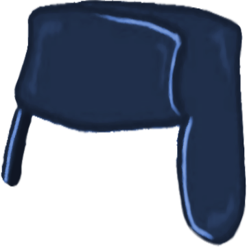

<h1>Ushanka</h1>

Custom Fedora Silverblue image

 

Many thanks to [Universal Blue](https://github.com/ublue-os) project for providing a way to create custom Silverblue images. Most of files in this repo are from [ublue-os/main](https://github.com/ublue-os/main) (some are slightly modified).

List of changes (compared to ublue-main):
* Only Silverblue (GNOME) images are created
* Removed some CLI apps, Firefox, GNOME Terminal, Totem Video Thumbnailer (ffmpeg thumbnailer is used instead), GNOME Background Logo extension
* Added GNOME Console, nautilus-python and a few development tools: dotnet7, gettext, glib2-devel, blueprint-compiler

This image is created for my personal needs, but feel free to use it if it fits your needs :blush:

---

[Ushanka](https://en.wikipedia.org/wiki/Ushanka) is a winter hat.

[ushanka.png](ushanka.png) is based on [this image](https://commons.wikimedia.org/wiki/File:Russia_Countryball.png) available under CC BY-SA 4.0.
